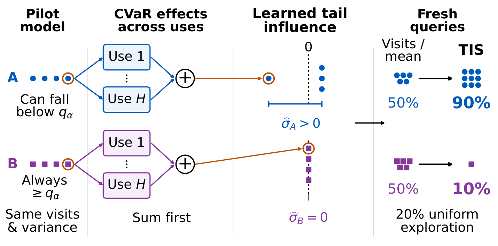

# Tail-Influence Sampling (TIS)

Code, frozen artifacts, and results for
*Tail-Influence Sampling for CVaR Policy Evaluation*.

<p align="center">
  
</p>

**The problem.** We want the CVaR of a fixed policy (its average return over
the worst α-fraction of runs) and can query any state--action pair directly,
for example by reconstructing a prompt in a language-model workflow. With a
fixed query budget, which conditional laws (kernels) should we sample?

**The idea.** A kernel matters for CVaR when its outcomes change how bad the
worst runs are. In the figure, kernels A and B are visited equally and have
the same reward mean and variance, but only A can fall below the tail cutoff
q_α. TIS draws a uniform pilot, computes each draw's first-order effect on
the CVaR estimate *summed over every use of its kernel*, and measures the
spread of these effects. Fresh queries are allocated in proportion to that
spread: here 90% to A and 10% to B (with 20% uniform exploration), where
visitation or mean influence would split them 50/50. Anchored TIS averages
this allocation with visitation to guard against pilots that miss rare
outcomes.

## Quick start

```bash
python -m pip install -r requirements-lock.txt -e .
PYTHONPATH=src python -m unittest discover -s tests      # 46 tests

tis run --config configs/public_quick.json               # small tabular run, about a minute
tis verify-results --directory results/public_quick
```

The language-model studies need no GPU to reproduce: every simulation
reruns on CPU from a configuration and its frozen kernels.

```bash
tis-llm-study run --config configs/llm_longh_qwen4b_h8.json \
    --kernels frozen/qwen_kernels.json --processes 8
python -m tis.finqa.cli run --config configs/finqa_longh_phi_ordinary.json \
    --kernels frozen/finqa_kernels_heldout2_phi_ordinary.json \
    --banks frozen/finqa_banks_heldout2.json --output results/finqa_longh_phi_ordinary
```

## Layout

| Path | Contents |
|---|---|
| `src/tis/` | Categorical Bellman engine, influence solver, allocation rules, tabular runner, and the `llm_study/` (MMLU-Pro) and `finqa/` pipelines |
| `configs/` | One JSON per experiment, recording every seed, budget, method, and floor |
| `frozen/` | Calibrated conditional kernels, question panels and candidate banks, generation audits, and declarations |
| `results/` | Run outputs (`panel_summary.csv`, `manifest.json`, ...) and analysis JSONs |
| `scripts/` | Analyses and figures; `scripts/README.md` indexes every script |
| `tests/` | Numerical identities, protocol invariants, determinism |

## From paper to code

| Paper result | Script | Inputs and outputs |
|---|---|---|
| Controlled separation (Table 1) | `controlled_separation.py` | `configs/controlled_separation.json`, `results/controlled_separation/` |
| CliffWalking and inventory curves (Figure 2), robustness | `make_figures.py`, `build_tabular_reconciled.py` | `results/tabular_reconciled.json`, run summaries |
| Inventory disruption family | `inventory_family.py gate`, `inventory_family.py simulate`, `inventory_family_analysis.py` | `configs/inventory_family.json`, `results/inventory_family/` |
| MMLU-Pro study tables | `llm_paper_analysis.py`, `llm_extension_analysis.py`, `strongest_baseline_table.py` | `results/llm_paper_numbers_closed.json`, `results/llm_extension_numbers.json` |
| Pilot mechanism figure | `mechanism_analysis.py` | `results/mechanism_analysis.json` |
| FinQA held-out study | `finqa_analysis.py`, `make_finqa_figure.py`, `finqa_supplement_tables.py`, `finqa_strong_baselines.py`, `finqa_paircheck.py` | `results/finqa_heldout_*/`, `results/finqa_paper_numbers*.json` |
| Blending controls (Table 2) | `finqa_mixture_analysis.py`, `llm_mixture_analysis.py llm_confident_mix`, `llm_mixture_analysis.py llm_brier_mix` | `results/*_mix*/`, `results/finqa_mixture_controls.json`, `results/llm_*_mix_analysis.json` |
| Tail--mean divergence | `divergence_statistics.py` | `results/divergence_statistics.json` |
| Prospective divergence test | `llm_mixture_analysis.py llm_divpred` | `results/llm_divpred_*/`, `results/llm_divpred_analysis.json` |
| Longer review loops | `long_horizon_analysis.py` | `results/*longh*/`, `results/long_horizon_analysis.json` |
| Pilot-based selection rule | `pilot_divergence_analysis.py` | `results/pilot_divergence_analysis.json` |
| FinQA with calculator faults | `run_finqa_toolfault.py`, `merge_budget_shards.py`, `finqa_toolfault_analysis.py` | `frozen/finqa_*toolfault*`, `results/finqa_toolfault_*` |
| Query cost at matched accuracy | `cost_to_accuracy.py`, `cost_multi_target.py` | `results/cost_to_accuracy.json`, `results/cost_multi_target.json` |
| Computation time | `method_timing.py` | `results/method_timing.json` |

All scripts live in `scripts/` and read only committed inputs.

## Declared experiments

Each later study was declared, with its settings, predictions, and
interpretation, before it ran, and every setting is reported:
`configs/inventory_family.json` and the `*_declaration.md` files in `frozen/`
(budget extension, blending controls, divergence prediction, calculator
faults, longer loops, and the pilot rule).

## Naming

MMLU-Pro kernels and results name generators by role: unmarked is Qwen3-4B,
`robustness` Phi-4-mini, `robustness2` Granite-4.2-8B, `scale1` Mistral-24B,
`scale2` Qwen3-32B, and `scale3` GLM-4-32B; `hs_` marks the high-stakes
panel and `closed` the closed-grid runs reported in the paper. FinQA names
give the workflow (`ordinary`, `unitcheck`) and generator (`_phi`;
unmarked is Qwen3-4B).

## Reproducibility notes

- **Seeds.** Every random stream is derived from the configured master seed,
  horizon, budget, question, replication, and stage, so runs can be split by
  budget or question and merged without changing any number; completed
  MMLU-Pro question cells are cached in `build/llm_cell_cache/`.
- **Calibration.** Kernels were calibrated once on GPU from pinned model
  revisions (`scripts/run_*.sh`, `requirements-llm-lock.txt`); reproduction
  needs only the frozen kernels.
- **Large files.** Some per-run files (`allocations.csv`, per-replication
  `raw.csv`, `allocation_summary.csv`) exceed repository limits; their
  SHA-256 checksums are in `results/external_artifacts.json`, and every
  reported number reproduces without them.
- **Verification.** `tis verify-results` checks a result directory against its
  `manifest.json`. Manifests also record source-file hashes from run time;
  the released code has since been tidied, so those entries can differ.
- **Instances.** The controlled and inventory instances follow the
  anti-tuning rule in `specs/replacement_instances.json`.
